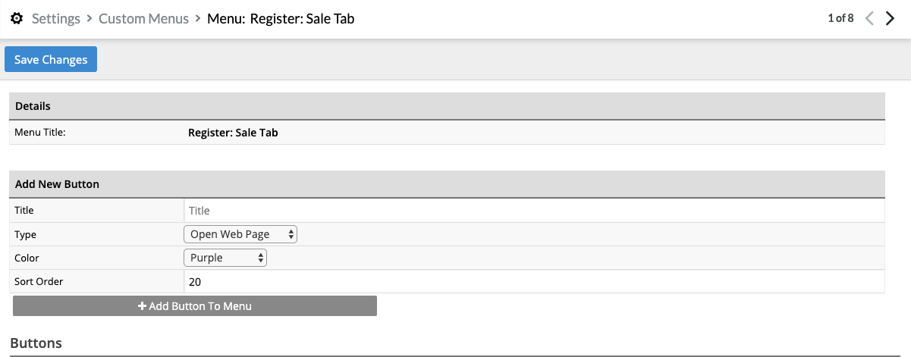
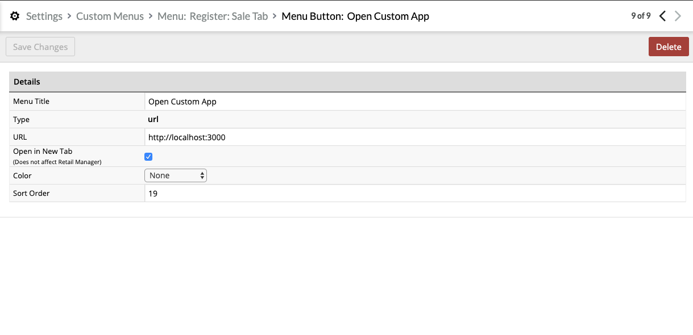
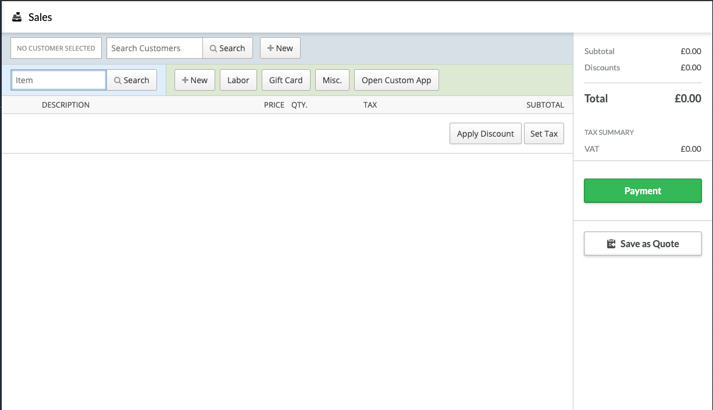

# How to Use example App

1. Add your own Auth module in utils/client.js
You can copy and paste an expiring bearer token into an .env file for testing

- To run App with Docker
```bash
    touch .env && echo "TOKEN=" > .env
    // Insert your Bearer token in the newly created .env file
chmod +x exec.sh
Then run ./exec.sh
```

# To run App with node
```bash
npm start
```

## Instructions

-App will start on port 3000
-Take the url http://localhost:3000 and insert into:
Settings> Advanced Setup > Custom Menus > Register: Sale Tab





Then simply navigate to the Sale tab and click on the button


